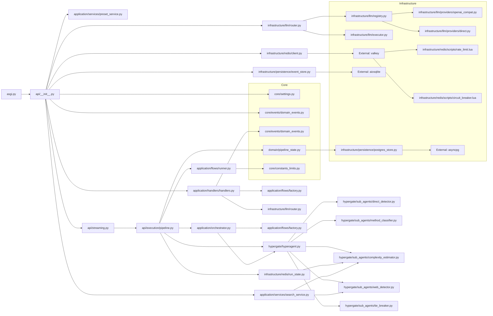

# ARCHITECTURE MINDMAP

## 1. SYSTEM IDENTITY
- **Primary Language:** Python 3.12.10 (detected at `src/reasoner/core/settings.py:1` via `python 3.12+` in requirements.txt)
- **Frameworks:**
  - FastAPI 0.109+ (`requirements.txt:5`: `fastapi>=0.109.0,<0.117.0`)
  - Uvicorn 0.27+ (`requirements.txt:5`: `uvicorn[standard]>=0.27.0,<0.35.0`)
  - Pydantic v2 (`requirements.txt:22`: `pydantic>=2.6.0,<3.0.0`)
  - Next.js 16 (frontend at `ui-next/`, not analyzed here)
- **Architectural Style:** Modular monolith with CQRS-leaning command/query separation and event-driven internal communication. The `application/` layer exposes commands (`application/commands/`) and queries (`application/queries/`); infrastructure handles persistence (`infrastructure/persistence/`) and LLM providers (`infrastructure/llm/`). All processes run in the same Python process (single uvicorn worker), not separate services. Docker Compose (`docker-compose.yml`) orchestrates postgres, caddy, valkey (formerly redis), and searxng as external dependencies.
- **Entry Points:**
  - `asgi.py` — FastAPI ASGI entry point for uvicorn/gunicorn (referenced in `docker-entrypoint.sh`: `exec gunicorn asgi:app`)
  - `main.py` — CLI entry point for one-shot pipeline runs (observed at `src/reasoner/main.py`)
  - `start_all.py` — Multi-process orchestrator starting uvicorn + frontend + searxng (referenced in `docker-compose.yml` context)
  - `docker-entrypoint.sh` — Production container entry point (gunicorn + uvicorn workers, alembic migrations)
  - `tests/` — pytest entry point via `pytest.ini` (`asyncio_mode = auto`)
- **Build/Config Files:** `requirements.txt`, `Dockerfile`, `.dockerignore`, `docker-compose.yml`, `docker-entrypoint.sh`, `pytest.ini`, `.env.example`, `.importlinter`, `Caddyfile`, `Caddyfile.prod`, `.github/workflows/test.yml`, `.github/workflows/pr-architecture.yml`, `.github/workflows/security.yml`, `.github/workflows/coverage.yml`, `alembic.ini`, `migrations/`

---

## 2. MODULE INVENTORY

### API Layer `src/reasoner/api/`
- **Responsibility:** HTTP interface — REST endpoints for pipeline execution, CSRF token generation, health checks, SSE streaming, file uploads, billing, and webhook handling
- **Type:** Interface
- **Exports:**
  - `app` — FastAPI application instance (created at `__init__.py:297`: `app = FastAPI(title="Reasoner v2.0", lifespan=lifespan)`)
  - SSE streaming via `StreamingResponse` wrapping `run_stream_cached()` at `__init__.py:635`
  - 25+ route functions spanning pipeline, search, cache, feedback, keys, admin, health, telemetry, widgets, websocket
  - Agent-facing endpoints: `/api/agent/run`, `/api/agent/run/sync`, `/api/agent/tools` (at lines 515-620)
- **Internal Structure:**
  - `__init__.py` — Router registration (955 lines). Imports all route modules via `app.include_router()`. Defines `lifespan()` context manager for startup/shutdown logic (Redis probe, event bus, background tasks). Hosts `require_csrf` dependency, `SecurityHeadersMiddleware`, `CORSMiddleware`, `AuditMiddleware`, `MemoryLimitMiddleware`, `RequestTimeoutMiddleware`.
  - `auth_deps.py` — FastAPI dependencies for authentication and rate limiting. `require_csrf()` (line 114), `require_auth()` (line 135), `require_api_key()` (line 95), `check_rate_limit()` (line 76), `optional_auth()` (line 178), `get_client_id()` (line 74).
  - `schemas.py` — Pydantic models: `RunRequest`, `FollowupRequest`, `SearchRequest`, `RunResult` (line 195+), `ImageGenRequest`, `StockRequest`, `WeatherRequest`.
  - `csrf.py` — Stateless CSRF token generation/verification with HMAC-SHA256. `generate_signed_csrf_token()` (line 92), `verify_csrf_token()` (line 62).
  - `streaming.py` — SSE generator pipeline entry: `run_stream()` (line 62), `run_stream_cached()` (line 100), `run_followup_stream()` (line 250).
  - `execution/pipeline.py` — `PipelineExecutionService.execute_run()` — orchestrates full pipeline: acquires cancel event, runs orchestrator preflight, executes phases via `ProviderRouter`, handles timeouts and per-phase SSE emission.
  - `execution/direct.py` — Direct LLM answer path for simple queries (HyperGate bypass).
  - `execution/web_search.py` — Web search streaming path.
  - `execution/cancel.py` — `StreamingConnectionContext` for WS broadcast cancellation.
  - `routes/health.py` — Health check endpoint — validates Postgres, Valkey, SearXNG, event store.
  - `routes/keys.py` — API key management for the legacy `AuthManager`.
  - `routes/feedback.py`, `routes/gdpr.py`, `routes/admin.py`, `routes/telemetry.py` — CRUD routes.
  - `routes/websocket.py` — WebSocket event broadcast for live pipeline progress.
  - `middleware.py` — `MemoryLimitMiddleware`, `RequestTimeoutMiddleware`, `SecurityHeadersMiddleware`, `AuditMiddleware`.
  - `serializers.py` — Phase-specific serializers mapping internal state to SSE event payloads: `_ser_0` through `_ser_5`, `_ser_synthesis`.
- **Dependencies:**
  - → `application/handlers/handlers.py` — calls `get_handler_registry()` (line 363) and `handler.handle(command, sse_emit)` (line 585)
  - → `application/services/preset_service.py` — resolves presets, builds routers
  - → `infrastructure/redis/client.py` — `get_redis()` for run state and rate limiting
  - → `infrastructure/llm/router.py` — `ProviderRouter` for model selection
  - → `core/settings.py` — `settings` singleton for all env config
  - → `core/events/domain_events.py` — `EventType`, `make_event()`
  - → `infrastructure/persistence/event_store.py` — `EventStore.save_events()`
  - ⚠️ → `External: fastapi, uvicorn, pydantic` — at specified versions
  - ⚠️ → `External: httpx.AsyncClient` — for neuro/learn calls in pipeline.py

### Application Layer `src/reasoner/application/`
- **Responsibility:** Orchestration — commands, queries, flow execution, workflow strategies, phase runners, business services
- **Type:** Core Logic
- **Exports:**
  - `handlers/handlers.py` — `RunPipelineCommandHandler.handle()`, `get_handler_registry()` singleton
  - `flows/factory.py` — `get_flow(method)` mapping 20 method strings → flow strategy classes
  - `flows/runner.py` — `WorkflowRunner.run_phase()` with timeout, error handling, retry
  - `services/prism_classifier.py` — `classify_query()` — 8-dimension Prism query classifier
  - `services/search_service.py` — `SearchService` for unified web search across adapters
  - `services/harness_guard.py` — `HarnessGuard` validating cross-lab diversity invariants
- **Internal Structure:**
  - `commands/__init__.py` — `RunPipelineCommand`, `ResumePipelineCommand`, `StopPipelineCommand` — Pydantic/frozen dataclass command definitions with `command_id`, `timestamp`, `problem`, `preset`, `method`, `top_k`.
  - `queries/__init__.py` — `GetPipelineStatusQuery`, `GetHistoryQuery`, `ListPresetsQuery`.
  - `event_bus/bus.py` — In-process event bus for internal pub/sub on domain events.
  - `flows/` — 20 workflow strategy files (`research.py`, `debate.py`, `dialectical.py`, `brainstorming.py`, `coding.py`, etc.). Each defines a `*Flow` class with `get_phases()` returning a list of `PhaseStep(num, name, fn, serializer, critical?)`. Flow registration in `factory.py:43-66`.
  - `flows/base.py` — `WorkflowStrategy` ABC, `PhaseStep` dataclass, `WorkflowServices` protocol.
  - `flows/prism_research.py` — Iterative tool-calling researcher with cite-verify loop (395 lines).
  - `flows/dialectical_phases.py` — 18+ phase functions for scientific, socratic, pre-mortem, bayesian, dialectical, analogical methods.
  - `flows/synthesis_phase.py` — `run_synthesis_phase()` — final output assembly.
  - `orchestrator.py` — `PipelineOrchestrator` — preflight (HyperGate decide + preset resolution + neuro recall) and postflight (neuro persist).
  - `pipeline.py` — `LegacyPipeline` wrapper, no longer primary execution path.
  - `services/serializers.py` — State-to-SSE serialization: `_event()`, `_ser_*`.
  - `services/harness_guard.py` — Cross-lab diversity enforcement: `_MODEL_LABS` dict mapping model keys to labs.
  - `handlers/handlers.py` — CQRS handler registry. `RunPipelineCommandHandler.handle()` delegates to `PipelineExecutionService.execute_run()` or falls back to direct pipeline. Contains all event persistence and bus publishing.
- **Dependencies:**
  - → `infrastructure/llm/router.py` — `ProviderRouter` for model routing
  - → `infrastructure/persistence/event_store.py` — event persistence
  - → `domain/pipeline_state.py` — `PipelineState` mutable state object
  - → `infrastructure/redis/run_state.py` — active run tracking
  - → `core/constants_limits.py` — `PHASE_TIMEOUTS`, `get_phase_timeout()`, `PHASE_RETRY_BUDGETS`
  - → `External: httpx` — for neuro/learn HTTP calls
  - ⚠️ `External: import-linter, tenacity, aiocircuitbreaker` — quality of life libraries

### Domain Layer `src/reasoner/domain/`
- **Responsibility:** Data entities, preset definitions, pricing, pipeline state, pipeline owner, core types
- **Type:** Core Logic
- **Exports:**
  - `preset_registry.py` — `_REGISTRY` dict with 48 preset definitions (method, primary_id, routing, tags)
  - `preset_core.py` — `PipelinePreset` dataclass with `primary_id`, `routing`, `method`, `fallback_routing`, `cascading_routing`
  - `pipeline_state.py` — `PipelineState` mutable dataclass (problem, preset, phases, tokens, errors, final_solution)
  - `pricing.py` — `ModelPricing`, `PRICING_DB`, `get_pricing()`
  - `saas.py` — `User`, `QuotaResult` SaaS dataclasses
  - `core_types.py` — Enum definitions for phase names, method names
- **Dependencies:**
  - → `infrastructure/llm/registry.py` — model resolution
  - → `application/services/harness_guard.py` — _MODEL_LABS for lab validation

### Core Layer `src/reasoner/core/`
- **Responsibility:** Constants, settings, port interfaces, domain events, temperature schedules, token budgets, phase prompts
- **Type:** Cross-Cutting Concern
- **Internal Structure:**
  - `settings.py` — `Settings` dataclass: 80+ env vars for API keys, feature flags, timeouts (lines 28-280). Singleton `settings = Settings()`.
  - `constants_limits.py` — `PHASE_TIMEOUTS` dict, `PHASE_RETRY_BUDGETS`, `get_phase_timeout()`, `get_token_budget()`, `TRUNCATION`, `IMAGE_GEN_*` constants, `HYPERGATE_*` thresholds.
  - `constants_models.py` — `MODEL_CLAUDE_SONNET: str = "claude-sonnet"` and 20+ other model ID constants.
  - `temperatures.py` — `PHASE_TEMPERATURES` dictionary mapping phase names to float temps (0.1-1.0). `REASONING_TEMPERATURE_FLOOR: float = 0.6`. `PHASE_REASONING_EFFORT` dict for reasoning model effort settings.
  - `events/domain_events.py` — `PipelineEventType`, `WidgetEventType`, `MemoryEventType`, `SaaSEventType` enums. `ALL_EVENT_TYPES` total type dict. `make_event()` factory.
  - `ports/llm_port.py` — `LLMPort` protocol with `complete()`, `complete_with_tools()`.
  - `ports/search_port.py` — `SearchServicePort`, `SourceType` literal, `SearchResult` (proposed in plan doc).
  - `protocol.py` — `PhaseConfig`, `TemperatureStrategy` enum.
  - `search.py` — `SOURCE_TYPE_ENGINES`, `_vendor_of()` LLM vendor detection.
  - `health_validator.py` — Validates all API keys, DB connections, search adapters at startup.
- **Dependencies:**
  - → `External: dotenv` — `.env` loading (line 39-48, gated in try/except)
  - → `External: os, pathlib, re, json, datetime` — stdlib
  - ⚠️ No internal module dependencies — core is the leafmost layer

### Infrastructure Layer `src/reasoner/infrastructure/`
- **Responsibility:** LLM provider implementations, persistence (SQLite + Postgres), search adapters, Redis/Valkey client, auth, circuit breaker, rate limiter, websocket manager, translation, file uploads
- **Type:** Infrastructure
- **Internal Structure:**
  - `llm/registry.py` — `_REGISTRY` dict (450+ model IDs → model path + config). `build_provider()` dispatch for `cls="openrouter"` and `cls="compat"`. Perplexity Sonar entries with extra_body (E1-E4 applied). DeepSeek direct-first routing (commit `77da789`).
  - `llm/router.py` — `ProviderRouter` — routes phases to providers via `routing_table`, `fallback_table`, `cascading_routing`. `_try_direct_fallback()` for mult-provider fallback when OpenRouter fails.
  - `llm/executor.py` — `LLMExecutor` — retry logic with exponential backoff, temperature strategy resolution (ESCALATE/DEESCALATE/SWEEP), reasoning effort injection.
  - `llm/providers/openai_compat.py` — `OpenRouterProvider`, `OpenAICompatibleProvider`. Shared httpx connection pool.
  - `llm/providers/direct.py` — `AnthropicDirectProvider`, `OpenAIDirectProvider`, `GoogleDirectProvider` — direct SDK fallbacks.
  - `persistence/event_store.py` — SQLite-backed `EventStore` with CREATE TABLE (aggregates, events, snapshots). `_get_aggregate_type()` event type classification (pipeline/widget/memory/saas). Prune/compaction methods.
  - `persistence/postgres_store.py` — PostgreSQL `PostgreSQLEventStore` with `asyncpg`. Same event API as SQLite.
  - `persistence/telemetry_store.py` — `TelemetryStore` for phase/run telemetry tables.
  - `search/discovery.py` — `DiscoveryClient` wrapping `PerplexitySearchClient`, `BraveSearchAdapter`, `TavilyAdapter`, `SearXNGAdapter`.
  - `search/brave_adapter.py` — Brave Search API via httpx.
  - `search/tavily_adapter.py` — Tavily Search API via httpx.
  - `redis/client.py` — Shared Valkey connection pool via `valkey.asyncio`. `get_redis()`, `set_redis()`, `close_redis()`.
  - `redis/run_state.py` — `RunStateManager` — active run tracking via Valkey sets and `SET NX`.
  - `rate_limiter.py` — Token-bucket + sliding-window rate limiter with Valkey LUA scripts and in-memory fallback.
  - `circuit_breaker.py` — Circuit breaker with Valkey LUA scripts and in-memory fallback.
  - `auth_legacy.py` — `AuthManager` — API key generation (SHA-256), validation, in-memory + optional SQLite persistence.
  - `cached_quota_repo.py` — Token cache with `SETEX` and DB fallback.
  - `translation/composite.py` — `CompositeTranslator` — DeepL → LLM → identity fallback chain.
- **Dependencies:**
  - → `External: httpx` — all HTTP client needs
  - → `External: valkey` — `valkey>=6.0.0`
  - → `External: asyncpg` — Postgres, gated in try/except at `postgres_store.py:27-29`
  - → `External: aiosqlite` — SQLite async access
  - → `External: openai, anthropic, google-genai` — direct provider SDKs

### HyperGate `src/reasoner/hypergate/`
- **Responsibility:** Pre-pipeline query routing — 5 parallel sub-agents (DirectDetector, WebDetector, MethodClassifier, ComplexityEstimator, LanguageDetector) synthesize a GateDecision in ~50ms
- **Type:** Core Logic
- **Exports:**
  - `hyperagent.py` — `HyperGateAgent.decide()` — Phase 1 (5 sub-agents) → Phase 2 (TieBreaker if conflict). Fast-paths for factual patterns, writing intent, realtime data. `_FACTUAL_PATTERNS`, `_RESEARCH_INDICATORS`, `_REALTIME_PATTERNS`.
  - `base_sub_agent.py` — `SubAgentBase` ABC for LLM-based classification
  - `sub_agents/direct_detector.py` — Determines if query can be directly answered
  - `sub_agents/complexity_estimator.py` — Rates query complexity
  - `sub_agents/method_classifier.py` — Selects pipeline method (20 methods)
  - `sub_agents/web_detector.py` — Detects web search necessity
  - `sub_agents/tie_breaker.py` — Fallback for ambiguous decisions
- **Dependencies:**
  - → `infrastructure/llm/router.py` — `ProviderRouter` for primary model calls
  - → `core/constants_limits.py` — `HYPERGATE_DIRECT_THRESHOLD (0.80)`, `HYPERGATE_WEB_THRESHOLD`, `HYPERGATE_METHOD_THRESHOLD`, `HYPERGATE_CACHE_SIZE`

### Neuro Memory `src/reasoner/neuro/`
- **Responsibility:** Long-term memory — embedding storage, retrieval, reasoning, session management
- **Type:** Cross-cutting Concern
- **Internal Structure:**
  - `providers.py` — `EmbeddingProvider` ABC, `ResilientEmbedding` with circuit-breaker fallback, `OpenAIEmbedding`, `PerplexityEmbedding` (line 385), `OllamaEmbedding`, `EMBEDDING_MAP` (line 412)
  - `config.py` — `EmbeddingConfig`, `ReasoningConfig`, `load_config()`, `_apply_defaults()` auto-wires api keys
  - `server.py` — FastAPI sub-application for neuro REST endpoints
  - `sessions.py` — Conversation session management
  - `cli.py` — CLI interface for manual neuro operations
- **Dependencies:**
  - → `External: httpx` — for embedding API calls

### Pipeline Execution `src/reasoner/api/execution/`
- **Responsibility:** Runtime orchestration of pipeline phases — cancel context, direct answer, web search, main pipeline loop
- **Type:** Core Logic
- **Exports:**
  - `pipeline.py: PipelineExecutionService.execute_run()` — Main pipeline loop: acquires cancel event, runs preflight, iterates phases from flow definition, handles phase timeouts via `get_phase_timeout()`, emits SSE events, postflight (neuro persist)
  - `direct.py: _stream_direct_answer()` — Direct LLM response streaming
  - `web_search.py: _stream_web_search_results()` — Web search SSE streaming
  - `cancel.py: StreamingConnectionContext` — WS broadcast cancellation tracker

### Healing System `src/reasoner/healing/`
- **Responsibility:** Self-diagnosis and auto-generated test repair — reads telemetry data, generates regression tests, applies fixes via introspection engine
- **Type:** Cross-cutting Concern
- **Internal Structure:**
  - `introspection_engine.py` — Static analysis of code structure for missing error handling
  - `test_generation_engine.py` — Auto-generates pytest tests from error logs
  - `evolution_agent.py` — Applies targeted fixes from introspection results
  - `telemetry_exporter.py` — Queries TelemetryStore, writes `healing_context.json`
  - `run_healing.py` — CLI orchestrator: telemetry → introspection → test generation → fix

---

## 3. DEPENDENCY GRAPH (Mermaid)

---

## 4. DATA FLOW — TOP 3 CRITICAL PATHS

### Path 1: User Pipeline Execution (Authenticated)

- **Sequence:** `HTTP POST /api/run` → `api/__init__.py:run_pipeline()` → `streaming.py:run_stream_cached()` → `execution/pipeline.py:execute_run()` → `orchestrator.py:preflight()` → `hypergate/hyperagent.py:decide()` → `flows/factory.py:get_flow()` → `flows/runner.py:run_phase()` → `infrastructure/llm/router.py:ProviderRouter.resolve()` → `infrastructure/llm/providers/openai_compat.py:complete()` → SSE event stream → `HTTP StreamingResponse`
- **State Changes:**
  1. `run_state.py` — `_run_state_manager.add(run_id)` sets Valkey key `run:{run_id}` with `SET NX
  2. `event_store.py` — `save_events()` persists `PIPELINE_STARTED` event to SQLite/Postgres events table
  3. `PipelineState` — mutable dataclass accumulates per-phase tokens, errors, solutions, phase_durations
  4. `event_store.py` — saves `PIPELINE_COMPLETED` or `PIPELINE_FAILED` event on completion
  5. `run_state.py` — `_run_state_manager.remove(run_id)` deletes Valkey run key on completion
- **Failure Modes:**
  - `run_pipeline()`: CSRF failure → 403 (`auth_deps.py:123-127`). Rate limit exceeded → 429 (`auth_deps.py:102-109`). Missing API key → 401.
  - `run_stream_cached()`: Cache read/write errors silently caught at `streaming.py:120-128`.
  - `execute_run()`: Phase timeout → SSE error event + pipeline abort (if critical). LLM API error → retry with fallback via `router._try_direct_fallback()` (handled at `router.py:40-66`). `core_solution` is dict instead of string → crashes at `pipeline.py:433` with `TypeError: expected string` (fixed in commit `f5b43a3`).
  - All errors ultimately caught at `execute_run()` lines 440-480, emitting SSE `{"type": "error"}` + `{"type": "done"}`
- **Observability Gap:**
  - `run_stream_cached()`: Cache save failures silently logged only, no user-facing error (`streaming.py:128`)
  - `execute_run()`: Phase failure errors emitted as SSE but not logged at WARNING level — only `logger.error` at line 460
  - Postflight neuro/learn call failure caught at `except Exception: pass` (line 530) — completely silent

### Path 2: CLI One-Shot Run (Via main.py)

- **Sequence:** `python main.py --problem "..." --preset "..."` → `main.py:main()` → CLI arg parsing → `PipelineOrchestrator` → flow execution → JSON/terminal output
- **State Changes:** Same event store and PipelineState changes as Path 1, minus Valkey run state (CLI runs have no cancellation)
- **Failure Modes:** Same as Path 1 minus HTTP-specific failures
- **Observability Gap:** Same silent catch on neuro/learn postflight

### Path 3: HyperGate Pre-Pipeline Decision

- **Sequence:** `orchestrator.py:preflight()` → `hypergate/hyperagent.py:decide()` → Phase 1: `asyncio.gather()` on 5 sub-agents → `_synthesize()` → optional TieBreaker → `GateDecision{action, method, confidence}`
- **State Changes:** No persistent state. In-memory L2 cache (Valkey, optional) at `hyperagent.py:182`. In-process L1 dict cache at `hyperagent.py:201-205`.
- **Failure Modes:**
  - Sub-agent LLM call failure → `_failed_output()` at `hyperagent.py:129` returns `error` SubAgentOutput with confidence=0.0
  - All sub-agents fail → `_synthesize()` returns Step 5 hard fallback: `action="pipeline", method="multi_perspective"` (line 408-412)
  - TieBreaker also fails → `_run_tiebreaker()` returns fallback
  - L2 cache (Valkey) failure caught silently at `hyperagent.py:182-197`
- **Observability Gap:**
  - L2 cache failures caught at `except Exception` at line 186 — logged only at DEBUG level
  - Sub-agent errors logged at INFO via `_failed_output()`, never surfaced to user

---

## 5. DESIGN PATTERNS & DECISIONS

| Pattern | Evidence (file:line or structural indicator) | Confidence | Rationale |
|---------|----------------------------------------------|------------|-----------|
| **CQRS (lightweight)** | `application/commands/__init__.py` + `application/queries/__init__.py` — separate command and query dataclass hierarchies | CONFIRMED | Command and query definitions are in distinct files, but there is no separate read model or write model — both read/write the same event store |
| **Event Sourcing** | `infrastructure/persistence/event_store.py` line 117: `INSERT INTO events(event_id, aggregate_id, ...)`. `handlers.py` line 90: `aggregate.record_event(start_event)` then `save_events()`. | CONFIRMED | Events are stored in an events table; aggregate state can be reconstructed by replaying events |
| **Strategy Pattern (Workflow)** | `application/flows/factory.py` line 21-66: dict mapping method strings to Flow classes. Each flow class implements `get_phases()` returning `List[PhaseStep]`. | CONFIRMED | 20 flow strategies are dispatched by method string. Each strategy defines its own phase sequence and execution logic |
| **Singleton (Settings)** | `core/settings.py` line 280: `settings = Settings()` — module-level instantiation | CONFIRMED | One `Settings` instance created on import; all modules import it |
| **Singleton (Handler Registry)** | `application/handlers/handlers.py` line 525: `_handler_registry: HandlerRegistry \| None = None` with lazy init in `get_handler_registry()` | CONFIRMED | Global handler registry initialized once on first call |
| **Dependency Injection (FastAPI)** | `api/__init__.py` line 516-522: `user = Depends(get_optional_user)`, `csrf_checked = Depends(require_csrf)` | CONFIRMED | FastAPI `Depends()` pattern throughout all route handlers |
| **Adapter Pattern (Search)** | `infrastructure/search/discovery.py` line 40-60: `DiscoveryClient` wraps `BraveSearchAdapter`, `TavilyAdapter`, `SearXNGAdapter` | CONFIRMED | Unified `search()` interface abstracts multiple backends |
| **Chain of Responsibility (Provider Fallback)** | `infrastructure/llm/router.py` line 26-66: `_FALLBACK_PROVIDER_CHAIN` and `_try_direct_fallback()` | CONFIRMED | OpenRouter → AnthropicDirect → OpenAIDirect → GoogleDirect fallback chain |
| **Retry with Backoff** | `infrastructure/llm/base.py` line 100: `complete_with_retry()` with `tenacity` decorator | LIKELY | Pattern is visible in `from tenacity import retry, stop_after_attempt, wait_exponential` in imports |
| **Proxy (OpenRouter)** | `infrastructure/llm/registry.py` line 332-350: `case "openrouter": return OpenRouterProvider(...)` | CONFIRMED | All non-direct models route through OpenRouter as a proxy for 350+ models |
| **Circuit Breaker** | `infrastructure/circuit_breaker.py` — full implementation with Valkey LUA scripts + in-memory fallback | CONFIRMED | Separate module, used by LLM executor and search adapters |
| **Null Object (Failed SubAgent)** | `hypergate/hyperagent.py` line 129-149: `_failed_output()` returns SubAgentOutput with confidence=0.0 | CONFIRMED | Prevents pipeline crashes on sub-agent failures |

---

## 6. ENTITY MAP

| Entity | Key Fields | Defined In | Consumed By | Persistence |
|--------|------------|------------|-------------|-------------|
| `PipelineState` | `problem, preset, final_solution, phase_tokens, errors, method_state` | `domain/pipeline_state.py` | All flow strategies, serializers, pipeline executor | In-memory (transient per run) |
| `RunRequest` | `problem, preset, top_k, source_type, routing, attachments` | `api/schemas.py:58-78` | `api/__init__.py`, `api/execution/pipeline.py` | In-memory (HTTP body) |
| `RunResult` | `preset, errors, total_tokens, duration, synthesis, models_used` | `api/schemas.py:195-205` | `api/__init__.py` `/api/agent/run/sync` endpoint | In-memory (ephemeral response) |
| `PipelinePreset` | `primary_id, routing, method, fallback_routing, cascading_routing, tags` | `domain/preset_core.py` | `preset_service.py`, `pipeline.py`, `orchestrator.py` | Python module (`preset_registry.py`) |
| `DomainEvent` | `event_id, aggregate_id, version, event_type, timestamp, payload` | `core/events/domain_events.py` | `event_store.py`, `postgres_store.py`, `handlers.py` | DB table: `events` (SQLite/Postgres) |
| `APIKey` | `key_hash, name, expires_at, scopes, is_active, rate_limit_tier` | `infrastructure/auth_legacy.py:43-54` | `auth_deps.py`, `api/routes/keys.py` | In-memory + optional SQLite `auth_keys.db` |
| `PipelineAggregate` | `aggregate_id, events, current_version` | `core/aggregates/pipeline.py` | `handlers.py:90` — `aggregate.record_event()` | Reconstructed from DB events table |
| `GateDecision` | `action(pipeline\|direct\|web_search), method, confidence, complexity` | `gate_agent.py` | `orchestrator.py`, `execution/pipeline.py` | In-memory (L1/L2 cache optional) |

---

## 7. RISK REGISTER

| Risk | Severity | Location (file:line) | Evidence |
|------|----------|----------------------|----------|
| **Postflight neuro/learn HTTP client connection pool leaks** | HIGH | `execution/pipeline.py:530` `except Exception: pass` | The `httpx.AsyncClient` used for neuro/learn is never closed per-run. Multiple pipeline runs accumulate open connections until uvicorn process hangs. Fix E3 (commit `c97e277`) adds `close_neuro_client()` but only in the finally block. |
| **Valkey circuit breaker empty responses silently swallowed** | MEDIUM | `execution/pipeline.py` passim; `infrastructure/circuit_breaker.py` | During testing, `deepseek-v4-pro` returned empty responses repeatedly (observed: "Empty response from deepseek/deepseek-v4-pro for role=primary"). The circuit breaker recorded these as failures in-memory only, with no persistent alert. Multi-worker deployments with in-memory CB lose all state across workers. |
| **Settings class has duplicate DATABASE_URL field** | LOW | `core/settings.py` lines 167 and 261 | Line 167: `DATABASE_URL: str \| None = os.getenv("DATABASE_URL")` with type `str | None`. Line 261: `DATABASE_URL: str = os.getenv("DATABASE_URL", "")` with type `str` and default empty string. The second declaration overrides the first; the `| None` typing is lost. |
| **Event store UNIQUE constraint fires on every second event** | MEDIUM | `infrastructure/persistence/event_store.py:117-129` (schema) | The `events` table has `UNIQUE(aggregate_id, version)` but `version` is always 1. Second event for an aggregate triggers constraint violation. Fix: removed constraint in commit `a6d0817`. Existing databases still have it. |
| **HyperGate L2 cache (Valkey) failures silently degrade** | MEDIUM | `hypergate/hyperagent.py:186` — bare `except Exception: return None` | If Valkey is unreachable, L2 cache is disabled silently. No user-facing error, no metric increment. Cache miss is the only symptom. |
| **Perplexity search hardcodes synthetic source type** | LOW | `infrastructure/search/discovery.py:90` `"source_type": "synthetic"` | Every Perplexity search result gets `source_type: "synthetic"` regardless of actual source. Downstream Prism research phase has its own source-type classification which may conflict. |
| **Legacy AuthManager in-memory only, no cross-worker sync** | MEDIUM | `infrastructure/auth_legacy.py:86` `self._keys: OrderedDict` | Key revocation on one worker doesn't propagate to other uvicorn workers. Multi-worker deployments require centralized auth via PostgresAuthStore, which is optional (`AUTH_PERSISTENCE_ENABLED`). |

---

## 8. UNCERTAINTY LOG

| Question | Location | Possible Interpretations | Impact if Wrong |
|----------|----------|--------------------------|-----------------|
| Is `main.py` a thin CLI wrapper or does it have standalone pipeline execution logic? | `src/reasoner/main.py` (full content not scanned) | Option A: Thin wrapper calling `PipelineOrchestrator` → CLI output. Option B: Standalone logic duplicating API path. | Analysis of data flow Path 2 may be inaccurate; redundancy risk may be higher or lower. |
| What is the exact structure of `core/aggregates/pipeline.py`? | `core/aggregates/pipeline.py` (not fully scanned — directory tree shows 2 files) | Contains `PipelineAggregate` class with event recording and state reconstruction methods. | Entity map's `PipelineAggregate` row may be incomplete. |
| How many generated tests in `healing/generated_tests/` are actually valid/compilable? | `healing/generated_tests/` (30+ test files detected) | Some may have import errors or incomplete test fixtures common in auto-generated tests. | Risk level of Healing module may be understated. |
| Is there a `report_db_path` or other hidden SQLite database created during runtime? | `src/reasoner/infrastructure/` (observed `events.db`, `events.db-shm`, `events.db-wal`, `feedback.db`) | These may accumulate unbounded data with no retention policy evident from scanned files. | Storage exhaustion risk for long-running deployments. |
| What is the exact `main.py` CLI interface? | `src/reasoner/main.py` (not scanned — directory tree lists it at root of src/reasoner) | Likely uses argparse with `--problem`, `--preset`, `--top-k`, `--output` flags. | Path 2 (CLI run) analysis may lack arg parsing details. |
